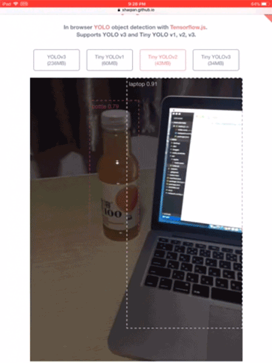

# tfjs-yolo demo

Demo for Javascript library https://www.npmjs.com/package/tfjs-yolo

## Sample code

- The online live demo detects objects from webcam stream. The source code is in ./docs directory. It's a PWA and uses service worker to cache data. https://shaqian.github.io/tfjs-yolo-demo/




- ./src has a more simple example that runs model on a picture.

## Run the App

### Install Dependencies

```
npm install
```

### Build for development

```
npm start
```

### Build for production

```
npm run build
```

## Tensorflow.js Model

The YOLO v3, Tiny YOLO v1, v2, v3 model files are stored in ./dist/model directory.